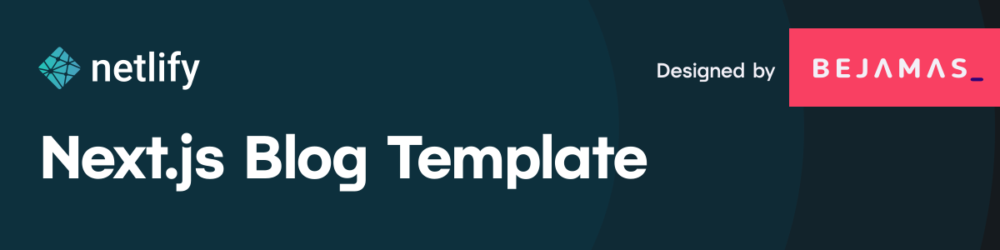

# 🚀 DIO Blog - Next.js + Supabase



[](https://vercel.com/new/clone?repository-url=https://github.com/SEU-USUARIO/dio-blog-nextjs-supabase)

## 📚 Sobre o Projeto

Este projeto é um dos **DESAFIOS DE PROJETOS** da **Formação React Developer** da [**DIO (Digital Innovation One)**](https://www.dio.me), uma das maiores plataformas de educação em tecnologia do Brasil.

### 👨‍💻 Especialista Responsável
**Pablo Henrique** - Desenvolvedor Full-Stack  
*Conduziu o projeto com foco em boas práticas e melhoria contínua*

> 💡 **Filosofia do Projeto**: Pablo Henrique sempre promove a ideia de **"nunca se contentar com o básico"** - sempre melhorar, otimizar e aplicar as melhores práticas do mercado em cada projeto desenvolvido.

## ✨ Melhorias Implementadas

Durante o desenvolvimento, foram aplicadas diversas melhorias além dos requisitos básicos:

### 🔧 **Melhorias Técnicas:**
- ✅ **Integração completa com Supabase** (substituindo dados mockados)
- ✅ **Tratamento robusto de erros** com componentes dedicados
- ✅ **Compatibilidade com Next.js 13+** (correção de Link components)
- ✅ **Variáveis de ambiente seguras** com validação
- ✅ **Políticas de segurança RLS** configuradas no Supabase
- ✅ **Sistema de posts dinâmico** com IDs UUID
- ✅ **Responsividade otimizada** para todos os dispositivos

### 📋 **Melhorias de Estrutura:**
- ✅ **Documentação completa** com guias de setup
- ✅ **Instruções de deployment** para produção
- ✅ **Scripts SQL automatizados** para configuração do banco
- ✅ **Componentes reutilizáveis** e organizados
- ✅ **Tratamento de estados de loading e erro**

### 🎨 **Melhorias de UX/UI:**
- ✅ **Design moderno** com Tailwind CSS
- ✅ **Tema escuro/claro** automático
- ✅ **Animações suaves** e transições
- ✅ **SEO otimizado** com meta tags dinâmicas
- ✅ **Performance otimizada** com Next.js

## 🛠️ Tecnologias Utilizadas

### **Frontend:**
- **[Next.js 15.4.1](https://nextjs.org/)** - Framework React para produção
- **[React 18](https://reactjs.org/)** - Biblioteca JavaScript para interfaces
- **[Tailwind CSS 3.0](https://tailwindcss.com/)** - Framework CSS utility-first
- **[MDX](https://mdxjs.com/)** - Markdown com suporte a JSX

### **Backend & Database:**
- **[Supabase](https://supabase.com/)** - Backend-as-a-Service (PostgreSQL)
- **[Supabase REST API](https://supabase.com/docs/guides/api)** - API RESTful automática
- **[Row Level Security (RLS)](https://supabase.com/docs/guides/auth/row-level-security)** - Segurança a nível de linha

### **HTTP Client & API:**
- **[Axios](https://axios-http.com/)** - Cliente HTTP para requests
- **REST API** - Arquitetura de comunicação

### **Estilização & UI:**
- **CSS Modules** - Estilização com escopo local
- **Responsive Design** - Layout adaptável
- **Dark/Light Theme** - Suporte a temas

### **Desenvolvimento & Qualidade:**
- **[ESLint](https://eslint.org/)** - Linter para JavaScript/React
- **[Prettier](https://prettier.io/)** - Formatador de código
- **Environment Variables** - Configuração segura
- **Git** - Controle de versão

### **Testing & Deploy:**
- **[Cypress](https://www.cypress.io/)** - Testes end-to-end
- **[Vercel](https://vercel.com/)** / **[Netlify](https://netlify.com/)** - Plataformas de deploy
- **CI/CD** - Integração e entrega contínua

### **Ferramentas de Desenvolvimento:**
- **[VS Code](https://code.visualstudio.com/)** - Editor de código
- **[Node.js](https://nodejs.org/)** - Runtime JavaScript
- **[npm](https://www.npmjs.com/)** - Gerenciador de pacotes

## 🚀 Como Executar o Projeto

### **Pré-requisitos:**
- Node.js 18+ instalado
- Conta no [Supabase](https://supabase.com)
- Git instalado

### **1. Clone o Repositório:**
```bash
git clone https://github.com/SEU-USUARIO/dio-blog-nextjs-supabase.git
cd dio-blog-nextjs-supabase
```

### **2. Instale as Dependências:**
```bash
npm install
# ou
yarn install
```

### **3. Configure o Supabase:**
1. Crie um projeto no [Supabase](https://supabase.com)
2. Execute o script SQL em `docs/DATABASE_SETUP.md`
3. Configure as políticas de RLS

### **4. Configure as Variáveis de Ambiente:**
```bash
cp .env.example .env.local
```

Edite o `.env.local` com suas credenciais do Supabase:
```bash
NEXT_PUBLIC_SUPABASE_URL=https://your-project.supabase.co
NEXT_PUBLIC_SUPABASE_ANON_KEY=your-anon-key
```

### **5. Execute o Projeto:**
```bash
npm run dev
# ou
yarn dev
```

Acesse: `http://localhost:3000`

## 📁 Estrutura do Projeto

```
📦 dio-blog-nextjs-supabase/
├── 📂 components/          # Componentes React reutilizáveis
├── 📂 docs/               # Documentação completa
├── 📂 pages/              # Páginas Next.js (roteamento)
├── 📂 services/           # Configuração de APIs
├── 📂 styles/             # Estilos globais
├── 📂 utils/              # Funções utilitárias
├── 📄 .env.example        # Template de variáveis
├── 📄 .env.local          # Configurações locais (não commitado)
├── 📄 .gitignore          # Arquivos ignorados pelo Git
├── 📄 next.config.js      # Configuração Next.js
├── 📄 package.json        # Dependências do projeto
├── 📄 tailwind.config.js  # Configuração Tailwind
└── 📄 README.md           # Documentação principal
```

## 📖 Documentação Adicional

- 📚 **[Setup do Supabase](docs/SUPABASE_SETUP.md)** - Configuração completa do backend
- 🗄️ **[Setup do Banco](docs/DATABASE_SETUP.md)** - Scripts SQL e estrutura
- 🚀 **[Deploy](docs/DEPLOYMENT.md)** - Guia de deployment em produção

## 🤝 Como Contribuir

1. **Fork** o projeto
2. **Crie** uma branch para sua feature (`git checkout -b feature/AmazingFeature`)
3. **Commit** suas mudanças (`git commit -m 'Add some AmazingFeature'`)
4. **Push** para a branch (`git push origin feature/AmazingFeature`)
5. **Abra** um Pull Request

## 📝 Licença

Este projeto está sob a licença MIT. Veja o arquivo [LICENSE](LICENSE) para mais detalhes.

## 👨‍🎓 Aprendizados

Este projeto demonstra:
- ✅ **Integração Frontend + Backend** moderno
- ✅ **Gerenciamento de estado** com React
- ✅ **Autenticação e segurança** com Supabase
- ✅ **Deploy em produção** com boas práticas
- ✅ **Código limpo** e bem documentado

## 🎯 Próximos Passos

- [ ] Sistema de autenticação de usuários
- [ ] Comentários nos posts
- [ ] Sistema de tags/categorias
- [ ] Busca avançada
- [ ] Painel administrativo

---

## 📋 Boas Práticas de README

Este README segue as melhores práticas de documentação:

### ✅ **Estrutura Clara:**
- **Título descritivo** com tecnologias principais
- **Badges** de deploy e status
- **Seções organizadas** com hierarquia clara
- **Índice navegável** (TOC)

### ✅ **Informações Essenciais:**
- **Descrição do projeto** e contexto
- **Tecnologias utilizadas** com links
- **Instruções de instalação** passo a passo
- **Como contribuir** para o projeto

### ✅ **Visual e Acessibilidade:**
- **Emojis** para facilitar a leitura
- **Formatação markdown** consistente
- **Blocos de código** com syntax highlighting
- **Links funcionais** para recursos externos

### ✅ **Manutenibilidade:**
- **Seções modulares** fáceis de atualizar
- **Versionamento** de dependências
- **Instruções de ambiente** reproduzíveis
- **Documentação adicional** referenciada

---

<div align="center">

**Desenvolvido com ❤️ durante a Formação React Developer na [DIO](https://www.dio.me)**

*"A melhor forma de prever o futuro é criá-lo"* - Abraham Lincoln

</div>
